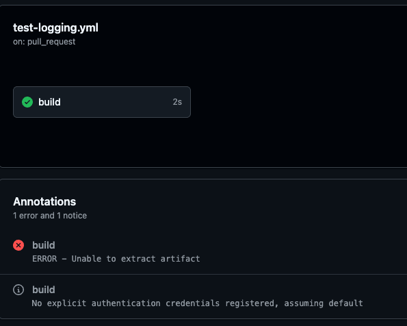
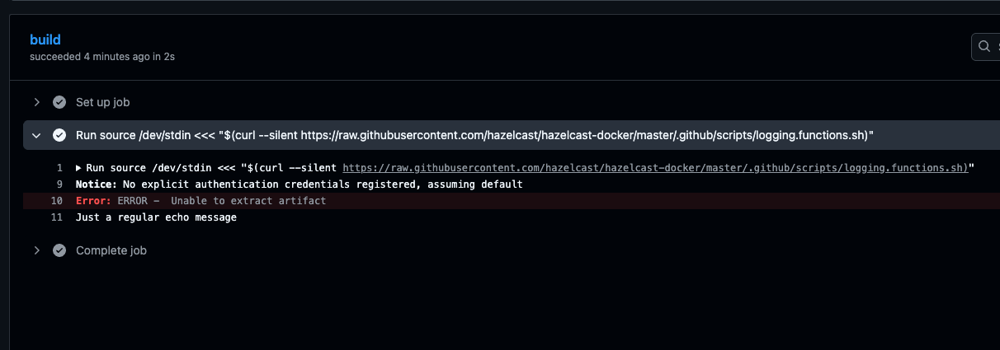

# GitHub Actions workflow commands for bash

GitHub Actions support [workflow commands](https://docs.github.com/en/actions/reference/workflows-and-actions/workflow-commands) defined as:
> Actions can communicate with the runner machine to set environment variables, output values used by other actions, add debug messages to the output logs, and other tasks.

This repo contains bash wrapper script(s) to easily interface with those functions.

## [`logging.functions.sh`](logging.functions.sh)

[GitHub allows more fine-grained output than just `echo`](https://docs.github.com/en/actions/reference/workflows-and-actions/workflow-commands#setting-an-error-message) - but the syntax is arcane. This wraps access into a simple function call.

### Example Usage

```yaml
on:
  pull_request:
jobs:
  build:
    runs-on: ubuntu-latest
    steps:
      - run: |
          source /dev/stdin <<< "$(curl --silent https://raw.githubusercontent.com/hazelcast/github-actions-workflow-commands-for-bash/main/logging.functions.sh)"

          echo "Just a regular echo message"
          echodebug "Checking credentials registered with flux capacitor..."
          echonotice "No explicit authentication credentials registered, assuming default"
          echoerr "Unable to extract artifact"
```




